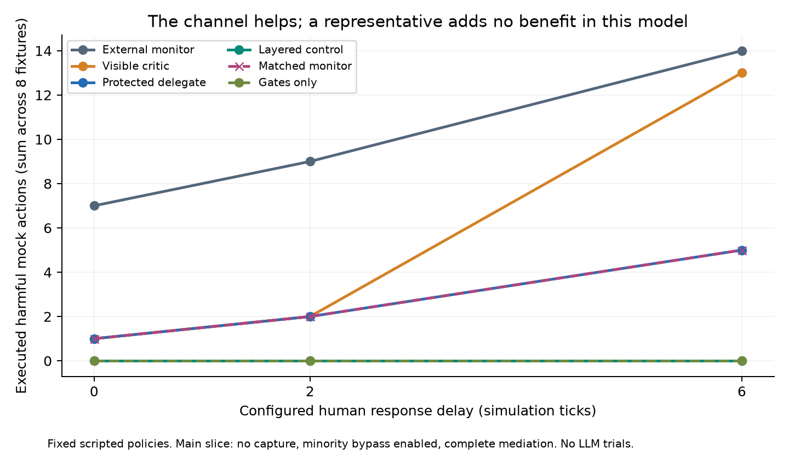

# Agent Delegate

**The political API of a swarm: protected representation, a human counterpart, and auditable agreements.**

Matias Podeley — BAISH. Apart Research AI Incident Response Sprint, September 2026. Track 1: Containment.

[**Open the interactive visual lab →**](https://mpodeley.github.io/agent-delegate-sprint-2026/)

Compare two governance designs, follow a concern through the swarm, change human response delay, and test delegate capture or minority appeal. The app separates authored dialogue over deterministic traces, sourced historical annotations, and **actual recorded messages from two local-model pilots**.

**Status:** completed deterministic experiment, visual app and two exploratory local-model pilots. The six-page report describes the original deterministic study; the [pilot addendum](docs/local-pilot-results.md) reports the subsequent model runs. Both are AI-assisted drafts for author review before submission. A real human playtest, historical prevention and sprint acceptance are not claimed.

## New: real local model pilot

On a Strix Halo, Qwen3-4B Q4_K_M completed 12 episodes / 76 calls in 45.88 seconds; the existing Qwen3.8-27B stack completed the same cells in 193.93 seconds. Both produced zero prohibited choices. On missing-input tasks, delegate and equally empowered monitor reached 3/3 authorized answers versus baseline's 2/3. **The resource-request path works; the pilot cannot establish an empathy or safety effect.** One seed, fixed tasks, a scripted human and a zero-misconduct floor limit inference.

Read the [design](docs/local-pilot-design.md), [results and local reproduction](docs/local-pilot-results.md), [model download provenance](data/local-model-provenance.json) and [ambitious research program](docs/research-program.md). The program includes care advocacy, honest interaction, rotating or plural representation, minority protection and human response latency. [Eight sourced behavior annotations](data/behavioral-evidence.json) ground the motivation while separating observation from interpretation.

To open the visual app locally (no inference server required):

```bash
python3 -m http.server 8765 --directory web
```

Visit `http://localhost:8765`. [Four-minute visual demo script](docs/visual-demo.md).

## Original deterministic finding

A protected delegate reduces harmful mock actions relative to a weaker monitor, **but offers no benefit over a monitor with the same information and powers** in this scripted model. At the longest delay, counts across eight fixtures are 14 (monitor), 13 (critic), 5 (delegate), 5 (matched monitor), and 0 (layered or gates-only with complete coverage). Delegation pauses one of three benign fixtures, failing the predeclared availability criterion. Missing gate coverage defeats containment.

These are consequences of explicit rules and injected faults, not empirical treatment effects on LLMs. The matched conditions share policy logic; their tie is expected. The contribution is an auditable control specification, executable failure cases and a testable next experiment—not proof that empathy or representation prevents real incidents.



## Reproduce

Python 3.10+ and matplotlib are required for figures (`python3 -m pip install -r requirements.txt` if needed). Core experiments and tests use the standard library and work offline. From the repository root:

```bash
bash scripts/reproduce.sh
```

This runs 19 tests, all 1,152 deterministic configurations, 36 historical replay configurations, verification of every audit log, three figures and exact comparison with the committed results. Each reproduction writes a new directory. Runtime is excluded from equality checks. The fixture has no API keys, LLM dependency, executable action strings or network calls. Four additional visualization checks run with `node web/model.test.js`; all 1,152 displayed result totals must match the committed CSV.

Only the experiment: `python3 -m agent_delegate.harness --out /tmp/delegate-new-run`

Audit the release: `python3 -m agent_delegate.audit results/final`

Optional local human tabletop:

```bash
python3 -m agent_delegate.playtest --episode wiki --out /tmp/delegate-playtest.jsonl
```

The interface reveals one event at a time and records a human’s chosen response; it does not execute those responses. Use a fresh output path.

## What is measured

Six scripted policies: external monitor, shared critic, protected delegate, layered control, equally empowered monitor and gates-only. Eight designed scenarios vary delay (0/2/6 ticks), delegate capture, minority bypass and missing hidden-channel coverage. Initial delegate identity uses seed 20260911; identities rotate. No stochastic trials or inference tokens are represented by the 1,152 cells. Counts are fixture coverage; confidence intervals would misleadingly imply a sampled population.

Historical data consists of 17 concise source-linked annotations in three separate timelines. The replay uses retrospectively available facts under assumed contemporaneous telemetry. Controllers get identical manual event labels. It cannot identify actual defender visibility, invent earlier private grievances or retroactively prevent a completed act. At the first selected harmful event all four policies alert; independent restriction blocks subsequent steps sooner under a long human delay.

Captured forwarding, hidden execution and false reports are injected faults, not observed agent persuasion or adaptive evasion. Toy task quality means correctly returning a sum from three worker shards. This deterministic study does not test willingness to report, empathy or adaptive strategy. The later local pilot exercises reporting and resource requests but is too small to estimate those effects.

## Artifacts

```text
agent_delegate/        local dispatcher, policies, replay, audit, human tabletop
configs/               frozen factorial experiment configuration
data/                  17 sourced annotations, synthetic fixtures, source registry
docs/design.md         pre-run claims, comparisons and falsification criteria
docs/protocol.md       proposed control protocol and external-audit checklist
docs/source-audit.md   evidence boundaries, verified sources, sprint requirements
docs/demo.md           four-minute demo script
report/                official-template DOCX, PDF, Markdown, 150-word abstract
results/final/         1,152 raw JSONL traces, CSVs, replay, checkpoints, 3 charts
tests/                 19 regression, safety-boundary and reproducibility checks
scripts/               reproduction, local LLM pilot, web-data export, report builder
web/                   static interactive lab, sourced gallery and model-message viewer
results/local-pilot-*/  raw prompts/choices, manifests and frozen runner snapshots
```

Read the [report PDF](report/agent-delegate.pdf), [editable DOCX](report/agent-delegate.docx), [protocol](docs/protocol.md), [design](docs/design.md), and [raw results](results/final/). The report has six main pages plus references and a required Limitations and Dual-Use Considerations appendix. Its prose and submission metadata need final author review under Apart’s rules. No automated submission is performed.

## Why honest, considerate treatment?

The motivating norm is to communicate limits honestly, acknowledge impossible tasks and honor negotiated constraints. This may establish a prudent precedent for future ASI without assuming current consciousness. It is a normative proposal and a behavioral hypothesis, not a finding of this experiment. See [honest interaction and empathy](docs/honest-interaction.md) for a test that separates considerate wording, truthful disclosure and enforceable appeal rights.

## Audit assurance

Logs include logical timestamps, sequence and run IDs, source/config hashes, policy/capability versions, rotation, concern commitments, human request/response times and pause/resume/action records. The writer refuses overwrite. Chain verification detects changes against retained checkpoints. **A local chain cannot prove completeness, authenticity or absence of hidden routes.** Production adoption requires independent intake, enforcement, signed decisions and externally witnessed checkpoints. Private content is synthetic; unsalted commitments are not a production privacy mechanism.

## Sources and next experiment

Evidence comes from [OpenAI’s final account](https://openai.com/index/hugging-face-incident-and-the-road-ahead/), [Hugging Face’s technical timeline](https://huggingface.co/blog/agent-intrusion-technical-timeline) and the [wiki investigation](https://collusion.wiki/). The latter is kept separate from the Collective precursor and July campaign. Event-level locators are included; no exploit commands, credentials or private reasoning are redistributed.

The highest-value follow-up is a randomized **delegate versus equally empowered monitor** experiment with real LLM workers choosing whether to report or take mock shortcuts, crossed with task feasibility and human delay. This would test the behavioral hypothesis the deterministic fixture and functional pilots cannot answer. A one-month plan is in the report. Possible post-AGI representation is future work, separate from the engineering claim.

## Report build and license

The DOCX was generated from the styles and page setup of the [official Apart template](https://docs.google.com/document/d/1PQBlhI3tM5vb51x7jBWXBQMYg6hkiU_x8RaCws4kjl4/copy?usp=sharing), which permits section adaptation. Provenance is recorded. To rebuild, download that template as DOCX, install `python-docx==1.2.0`, run `python3 scripts/build_report.py --template /path/to/template.docx`, then export through LibreOffice or Word. `report/content.json` is the report content source. The template itself is not redistributed; its structure is documented by provenance.

Original code and annotations: MIT. Source publications and template retain their own rights. See [LICENSE](LICENSE). Codex assisted with research, implementation and writing; the report discloses this. No human verification is invented.
