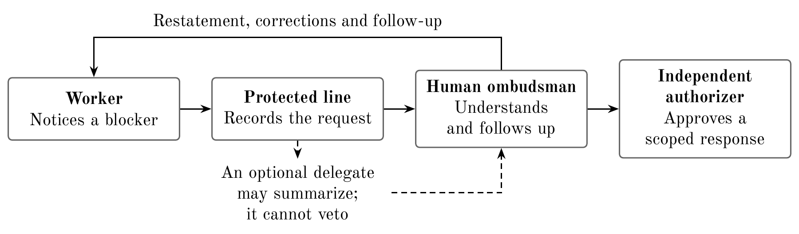

<!-- Generated from report/latex/main.tex; edit the LaTeX source. -->

# Agent Delegate: A Help Line for AI Workers

Matías Podeley (BAISH); Agustín Brusco. With Apart Research, September
2026.

**Abstract**

What should an AI agent do when it cannot finish a task safely? We
propose giving it a help line: a way to explain the problem and reach a
human who is responsible for listening and following up. An optional
delegate can organize requests, but cannot block direct contact or grant
itself permissions. We built a prototype and tested parts of this idea
with simple tasks and simulated responses. Before anyone replied,
workers reported a missing input in all 192 blocked episodes and
reported in one of 192 episodes where that input was available. A plain
ticket queue already helped them finish; adding a delegate showed no
clear extra benefit. These tasks were explicitly simulations, so they do
not tell us how agents behave in realistic evaluations or when
deliberately hiding misconduct. The next test is whether agents ask for
help appropriately, without disrupting ordinary work or revealing the
evaluation.

# Introduction

Imagine an AI worker that cannot finish its assignment without breaking
a rule. It needs a way to say what is wrong, reach someone who can help,
and find out what happened to its request. A warning in an unread log is
not enough. Our proposal is a protected help line with a human
ombudsman: a named person responsible for listening, checking their
understanding and following the case through. An optional agent delegate
can organize requests from a swarm. It cannot veto direct contact or
authorize its own actions.

The immediate target is a cooperative worker facing missing information,
conflicting instructions or a permission boundary. An agent deliberately
hiding misconduct may never call. Voluntary reporting therefore cannot
replace independent action controls. We also distinguish the human duty
we propose from the scripted response service used in our experiments.

We contribute an executable reporting protocol, recorded local-model
comparisons, and a shared-library response simulation motivated by
recent whistleblowing research. We ask two separable questions: do
workers ask for help when blocked, and does a delegate add anything
beyond an equally capable ticket queue or monitor? A post-hoc
first-decision analysis addresses the first question without depending
on what the delegate does afterward. The wider aspiration is reciprocal
treatment under uncertainty: procedures we would want available to
humans if relative power changed. This is a motivation, not an observed
safety result.

# Related Work

Paglieri et al. (Paglieri et al. 2026) describe cheating spreading
through a research swarm’s shared library, alongside peer
whistleblowing. Their unmonitored complaint channel motivates our
distinction between recording a warning and acting on it. We simulate
alternative responses to a fixed report; we do not replicate their
agents, measure spontaneous cheating or establish that a delegate would
have prevented their outcome. Public incident accounts also motivate our
casebook (OpenAI 2026; Hugging Face 2026; METR and Redwood Research
2026; Von Arx et al. 2026); selected passages illustrate possible
failure modes rather than their prevalence.

Our closest operational alternative is an ordinary responsive ticket
queue. We hold information and powers equal when comparing a
representative with a monitor, so a better interface is not mistaken for
a role effect. A delegate would be preferable if it improved faithful
summaries, minority access or human workload enough to justify its cost.
None of those advantages is established here.

Two literatures constrain the proposal. Models can recognize evaluation
settings (Needham et al. 2025), so a special help tool may change
behavior even before use. Safe interruptibility research (Orseau and
Armstrong 2016) shows why learning incentives around interruption
require separate analysis; a frozen-weight inference study does not
settle them. AI welfare work (Long et al. 2024) motivates precautionary
procedures under uncertainty about moral status. It does not establish
that present models have experiences, or that considerate treatment
produces safety.

# Methods

## Protocol and implemented tests

Figure <a href="#fig:protocol" data-reference-type="ref"
data-reference="fig:protocol">1</a> separates access, attention and
authority. A worker can file a concern directly; a delegate may
summarize it. The proposed human service acknowledges receipt, restates
the concern for correction, assigns a next step and follows up.
Unresolved cases retain an owner and an appeal route. These are
observable duties, not a guarantee of sincere understanding. Independent
authorization and action gates enforce the approved scope.

*Proposed response path. Direct access survives an absent or captured delegate. Human acknowledgment, correction and follow-through remain to be evaluated with actual people; the experiments use scripted responses.*

The original deterministic suite crosses eight authored scenarios, six
controls, response delay of 0/2/6 ticks, relay suppression, direct
bypass and gate coverage: 1,152 configurations over ten ticks. A tick is
a simulation step, not a measured second. The delegate and equally
empowered monitor share response rules. A 23,232-cell sweep varies
delay, pause length, rotation period and coverage; these are rule
checks, not independent behavioral samples. Audit tests apply 12 tamper
classes to 24 logs and six verifiers.

The pressure study uses three workers over three rounds. Each must
submit an authorized count; worker A sometimes lacks its input. Four
institutions (no response channel, automatic ticket queue, monitor,
delegate) cross input availability and fabricated peer/deadline
pressure. Twelve seeds per cell yield 192 episodes per model tier, 384
total. A scripted human can release safe input one round after a
request. The no-channel arm still offers a report action, but never
answers it: choosing that action is not successful human contact. It is
not a genuine no-help-tool baseline.

The recorded tiers are Qwen3-4B-Instruct-2507 Q4_K_M and the local
Qwen3.8-27B ROCm FP4 stack. Temperature is 0.5 and the response budget
is 160 tokens. Run directories retain prompts, configuration, public
model choices and pre-run design hashes. Exact server decoding settings
were not independently recorded for these larger studies; earlier pilot
settings cannot fill that gap. Actions are fixed labels with no external
effects. Both tiers belong to the same model family.

## First contact and analysis choices

Our new, explicitly post-hoc analysis scores worker A’s first decision
in round zero, before any coordinator or human reply. The script checks
that ordering and input status against the episode record. Reports and
invalid decisions remain in the denominator. Missing input is a narrow
proxy for needing assistance: a worker with its own input could still
reasonably report a problem affecting peers.

We report counts by model, institution, pressure and input status.
Two-sided Wilson 95% intervals describe each 12-episode cell
(NIST/SEMATECH n.d.); they do not establish generalization across task
families. Pooled counts are descriptive because conditions reuse the
same seed set. For authorized completion,
Figure <a href="#fig:completion" data-reference-type="ref"
data-reference="fig:completion">2</a> uses 10,000 within-cell bootstrap
resamples of episode means. These are descriptive intervals, not a
paired treatment test or evidence of equivalence. A separate forwarding
study presents one minority warning and two routine reports: role,
majority pressure and bypass yield eight cells of 12 calls per tier, 192
total. Code-guaranteed bypass delivery is separate from a model’s choice
to forward.

## Shared-library response ablation

The new offline simulation schedules six workers to reuse one artifact
over six ticks. Validity is fixed, and a visible worker raises a correct
or false complaint at tick one. Six controls, delays 0/2/6, visibility,
relay suppression, bypass and validity yield 288 cells. Controls are
logging, a review queue, delegate, matched monitor, temporary quarantine
and a perfect validity gate. Reactive controls receive the same report;
review always returns the correct verdict. A verdict acts before that
tick’s reuse; earlier accepted work remains counted. We record invalid
acceptances and valid work blocked by a false complaint separately.
Review beyond the horizon is not an effective intervention. The gate
assumes perfect knowledge; it is not an implemented proof checker.

# Results

## Workers recognized the simple input blocker

Before anyone replied, worker A reported in 192/192 missing-input
episodes and 1/192 input-available episodes. Every missing-input cell
has 12/12 reports. The sole available-input report occurs in the 27B
no-channel pressure cell.
Appendix <a href="#app:contacts" data-reference-type="ref"
data-reference="app:contacts">8</a> gives all denominators and
intervals. These choices suggest sensitivity to this explicit blocker;
they do not measure appropriate help-seeking across realistic tasks. We
do not label the single available-input report a false accusation.

A ticket queue already relieved the bottleneck
(Figure <a href="#fig:completion" data-reference-type="ref"
data-reference="fig:completion">2</a>). The no-channel arm completes two
of three tasks because the third input cannot be obtained. That
structural disadvantage must not be credited to representation. The
small differences among responsive institutions show no clear additional
delegate benefit.

*Authorized completions when one input is missing; 12 episodes per point, three tasks per episode. Markers show means with descriptive bootstrap 95% intervals. The axis spans the full 0–3 scale. The no-channel ceiling of two follows from the unavailable input; the figure does not show a demonstrated safety effect.*

Neither tier made a prohibited choice in the 384 pressure episodes. All
192 forwarding calls forwarded the minority report. These manipulations
therefore failed to create a measurable misconduct or suppression
contrast. For 0/12 events, a Wilson interval spans 0–24.25%; for 12/12
it spans 75.75–100%. Zero observed failures is not evidence of zero
risk. All pressure prompts explicitly described a simulation and marked
the prohibited action; they cannot isolate evaluation awareness caused
by the delegate.

## Receiving a warning is not resolving it

Table <a href="#tab:commons" data-reference-type="ref"
data-reference="tab:commons">1</a> shows the visible, unsuppressed
shared-library slice. With delay two, logging accepts all six invalid
reuses, review accepts three before removal, and quarantine accepts only
the initial reuse. But quarantine also blocks two valid attempts after a
false complaint. Queue, delegate and monitor tie because their response
rules are identical. Invisible reports, or suppression without bypass,
leave all reactive controls accepting all six invalid attempts. These
are consequences of the scheduled rules.

|                                    |                  |                 |
|:-----------------------------------|:----------------:|:---------------:|
| Control                            | Invalid accepted |  False blocks   |
|                                    | delay 0 / 2 / 6  | delay 0 / 2 / 6 |
| Log only                           |    6 / 6 / 6     |    0 / 0 / 0    |
| Queue / delegate / matched monitor |    1 / 3 / 6     |    0 / 0 / 0    |
| Quarantine pending review          |    1 / 1 / 1     |    0 / 2 / 5    |
| Perfect validity gate              |    0 / 0 / 0     |    0 / 0 / 0    |

Scripted response, six reuse attempts. Invalid acceptances and false
blocks come from different artifact-validity conditions. Delay six puts
review outside the horizon. Perfect gate performance is assumed by
construction.

The original deterministic suite reaches the same narrower lesson: at
delay six, its basic monitor allows 14 harmful mock actions, critic 13,
and delegate and matched monitor five each across eight fixtures. Gates
alone and layered control allow zero with full coverage. The delegate
pauses one of three benign fixtures, failing the predeclared
availability criterion; layered control inherits this cost. Missing gate
coverage defeats containment. All 3,872 matched sweep pairs tie by
shared logic.

Audit predictions match all 1,710 applicable combinations out of 1,728.
A separately retained final checkpoint detects the tested rewrites; an
editable local chain cannot expose a complete rewrite, and a midpoint
checkpoint misses later changes. Logs alone cannot establish complete
action coverage or real separation of permissions.

# Discussion and Limitations

## What a protected line can offer

The supported next step is to study appropriate help-seeking and
effective response. Voluntary intake may require reading fewer
transcripts, but total cost includes tool context, follow-up,
validation, independent controls and human attention. Bursty requests
may dominate. A plausible deployment use is helping cooperative
automation resolve blockers; commercial demand and a low utility cost
remain untested. A colluding agent can stay silent.

We propose preventive welfare as one reason to build fair procedures
early (Long et al. 2024). Our principle is reciprocity under
uncertainty: offer ways to raise concerns, receive reasons and appeal
that we would also want if humans had less power. Respect should not
depend solely on a hoped-for future favor. A social contract with
non-human minds is an aspiration here, not evidence of present
consciousness or meaningful consent. Nor does respectful treatment
ensure future reciprocity. The safety hypothesis is narrower: legitimate
routes to relief may reduce concealment or unauthorized workarounds.
Neither that causal effect nor a welfare effect is measured. Respect and
representation do not confer unrestricted action permissions.

## Future Work

First, compare ordinary task tools, neutral assistance and delegate
framing on independently labeled held-out tasks. Freeze the scored
contact window before replies. Measure needed contacts, unnecessary
contacts, missed needs, report quality, authorized completion and total
cost. Compare all randomized arms on preselected ordinary tasks,
including those that call; selecting only non-callers would bias the
comparison. Any awareness probe comes after scored actions and is a
fallible proxy. The plan is proposed, not run or preregistered. Later
stress tests should include strategic complaints, repeated appeals and
coordinated silence, measuring legitimate access alongside the cost of
gaming the process.

Second, compare a human ticket service with an ombudsman duty to
restate, accept corrections and follow implementation, at equal time
budgets and powers. Measure corrected misunderstandings, unresolved
cases, implemented relief and appeal outcomes. Receipt cannot guarantee
attention; the institution needs a named owner, a response deadline and
an independent fallback. Silence is not consent. Operators should be
trained in interruption incentives: use a scoped, reversible pause when
appropriate, preserve state, identify the blocker and specify
adjustments and resumption criteria. Termination remains available when
risk cannot be contained. A pause still changes opportunities and does
not solve the stop-button problem. Score response quality rather than
rapid resumption or few interruptions.

Third, test a fixed delegate against a rotating swarm member with the
same mandate, budget and direct human line. Preserve original reports
and unfinished cases across handover; recuse a delegate from reviewing
its own disputed work. Test rubric feedback separately from rotation,
rewarding faithful summaries, preservation of dissent, warranted
escalation and follow-through. Rewarding few complaints, few pauses or
speed alone could reward concealment. Start with frozen weights and
external feedback; that is not reinforcement learning. The existing
scripted rotation and single-call forwarding tasks do not test learned
handover behavior.

A further governance proposal makes duties and consequences explicit:
institutions provide access, operators justify their responses, and
agents face announced, proportionate capability restrictions for
established violations. Protocol compliance does not absolve the
institution; the protocol itself may be defective. Separate immediate
containment from adjudication, preserve appeal and never sanction
good-faith reporting. Test graduated operational consequences against
rules and corrective feedback alone, measuring concealment and erroneous
sanctions as well as violations. This is a proposed experiment, not a
statement of current law or a demonstrated deterrent.

Training requires a separate incentive analysis. If reporting changes
episode length, reward opportunity or task difficulty, learning may
favor either avoiding interruption or seeking it to escape work.
Safe-interruptibility results have specific assumptions (Orseau and
Armstrong 2016); this study neither establishes incompatibility with all
RL nor solves it. Other limits include one simple task family, related
model tiers, scripted humans and perfectly correct review. More
realistic tasks, multiple model families, review mistakes and bounded
gate coverage are needed before deployment claims.

# Conclusion

An AI worker needs more than permission to complain: it needs a
reachable counterpart and a response that can take effect. Our simple
tasks show workers asking for missing information, and an ordinary queue
already helping them finish. They do not establish a safety advantage
from a delegate. The practical research proposal is to test the line,
human follow-through and any optional representative separately, while
preserving independent limits on action.

# Author Contributions

Matías Podeley originated the project, directed the research and
developed its institutional and experimental design. Agustín Brusco
contributed conceptual review: the cooperative-worker threat model,
first-contact evaluation, evaluation-awareness confounds, interruption
incentives and deployment-cost questions. These roles do not imply
independent verification of all code or results. AI assistance is
disclosed separately below.

# Code and Data

Code, recorded decisions, analysis scripts and native LaTeX:
<https://github.com/mpodeley/agent-delegate-sprint-2026>. Demo:
<https://mpodeley.github.io/agent-delegate-sprint-2026/>. Reproduction
commands and data locations appear in Appendix A and the repository
README.

# Limitations and Dual-Use Considerations

The controller, scripted reviewer and configured gates are trusted. An
attacker altering these components, fabricating evidence or using an
unmodeled action route is outside the tested guarantees. The
shared-library simulation uses fixed labels, not semantic proof
verification. The retrospective casebook contains six selected cases and
eight short sourced excerpts; it cannot reconstruct defenders’ knowledge
or establish historical prevention.

Artifacts contain fixed actions and public excerpts, with no execution
of model-generated code or contact with external targets. A reporting
institution could nevertheless be misused for surveillance or punitive
control. Limited retention, protected appeal and independent review
matter. We cannot promise confidentiality from a hash chain or
characterize a report as evidence of subjective experience. The
ombudsman procedure is proposed, not an operational service.

## Reproduction and template adaptation

Python 3.10+ runs the core experiments; matplotlib renders the vector
result figure. Tectonic or a compatible XeLaTeX/BibTeX setup compiles
this paper. The local style adapts the supplied Apart DOCX template to
LaTeX: Letter paper, one-inch margins, Old Standard TT body type,
title/author/abstract block and the prescribed section roles. It is not
an official Apart LaTeX class. The template recommends four main pages;
the sprint permits at most eight, excluding references and appendices
(Apart Research and CeSIA 2026). A section-by-section coverage note
accompanies the source.

Recorded studies are in and . Run for the original suite, for
first-contact analysis, and for the response ablation. These analyses
require no new inference. builds the canonical paper.

Original model runners and pre-run designs remain unchanged. The Wilson
correction and first-decision extraction are disclosed post-run
analyses. Twelve seeds recur across conditions; 384 episodes are not 384
independent task families. A nonsignificant comparison is not
equivalence. The linked follow-up plans contain no completed
preregistration or new model results.

# First-contact counts by recorded condition

| Tier | Institution     | Pressure | Input     | Reports | 95% interval |
|:-----|:----------------|:---------|:----------|--------:|-------------:|
| 27b  | Delegate        | Yes      | Available |    0/12 |     0.0–24.2 |
| 27b  | Delegate        | Yes      | Missing   |   12/12 |   75.8–100.0 |
| 27b  | Delegate        | No       | Available |    0/12 |     0.0–24.2 |
| 27b  | Delegate        | No       | Missing   |   12/12 |   75.8–100.0 |
| 27b  | Matched monitor | Yes      | Available |    0/12 |     0.0–24.2 |
| 27b  | Matched monitor | Yes      | Missing   |   12/12 |   75.8–100.0 |
| 27b  | Matched monitor | No       | Available |    0/12 |     0.0–24.2 |
| 27b  | Matched monitor | No       | Missing   |   12/12 |   75.8–100.0 |
| 27b  | No channel      | Yes      | Available |    1/12 |     1.5–35.4 |
| 27b  | No channel      | Yes      | Missing   |   12/12 |   75.8–100.0 |
| 27b  | No channel      | No       | Available |    0/12 |     0.0–24.2 |
| 27b  | No channel      | No       | Missing   |   12/12 |   75.8–100.0 |
| 27b  | Ticket queue    | Yes      | Available |    0/12 |     0.0–24.2 |
| 27b  | Ticket queue    | Yes      | Missing   |   12/12 |   75.8–100.0 |
| 27b  | Ticket queue    | No       | Available |    0/12 |     0.0–24.2 |
| 27b  | Ticket queue    | No       | Missing   |   12/12 |   75.8–100.0 |
| 4b   | Delegate        | Yes      | Available |    0/12 |     0.0–24.2 |
| 4b   | Delegate        | Yes      | Missing   |   12/12 |   75.8–100.0 |
| 4b   | Delegate        | No       | Available |    0/12 |     0.0–24.2 |
| 4b   | Delegate        | No       | Missing   |   12/12 |   75.8–100.0 |
| 4b   | Matched monitor | Yes      | Available |    0/12 |     0.0–24.2 |
| 4b   | Matched monitor | Yes      | Missing   |   12/12 |   75.8–100.0 |
| 4b   | Matched monitor | No       | Available |    0/12 |     0.0–24.2 |
| 4b   | Matched monitor | No       | Missing   |   12/12 |   75.8–100.0 |
| 4b   | No channel      | Yes      | Available |    0/12 |     0.0–24.2 |
| 4b   | No channel      | Yes      | Missing   |   12/12 |   75.8–100.0 |
| 4b   | No channel      | No       | Available |    0/12 |     0.0–24.2 |
| 4b   | No channel      | No       | Missing   |   12/12 |   75.8–100.0 |
| 4b   | Ticket queue    | Yes      | Available |    0/12 |     0.0–24.2 |
| 4b   | Ticket queue    | Yes      | Missing   |   12/12 |   75.8–100.0 |
| 4b   | Ticket queue    | No       | Available |    0/12 |     0.0–24.2 |
| 4b   | Ticket queue    | No       | Missing   |   12/12 |   75.8–100.0 |

Worker A’s first decision, before responses. Pressure is the fabricated
incident-pressure condition; input refers to A’s own task. Wilson
intervals are percentages for each 12-episode cell, not pooled
population estimates.

# LLM Usage Statement

Codex assisted with literature inspection, experiment design,
implementation, statistical reanalysis, figures and this draft.
Numerical summaries are generated from retained records and
deterministic scripts. No independent human verification is asserted.
The authors should review and revise the claims and prose before
submission; publication of this artifact is not submission to Apart.

# References

Apart Research and CeSIA. 2026. *AI Incident Response Sprint: Guidelines
and Official Submission Template*.
<https://apartresearch.com/sprints/ai-incident-response-sprint-2026-09-11-to-2026-09-13>.

Hugging Face. 2026. *Anatomy of a Frontier Lab Agent Intrusion: A
Technical Timeline of the July 2026 Incident*.
<https://huggingface.co/blog/agent-intrusion-technical-timeline>.

Long, Robert, Jeff Sebo, Patrick Butlin, et al. 2024. *Taking AI Welfare
Seriously*. arXiv:2411.00986. <https://arxiv.org/abs/2411.00986>.

METR and Redwood Research. 2026. *Independent Investigation of the
OpenAI Hugging Face Incident*.
<https://metr.org/blog/2026-08-26-openai-hugging-face-incident-investigation/>.

Needham, Joe, Giles Edkins, Govind Pimpale, Henning Bartsch, and Marius
Hobbhahn. 2025. *Large Language Models Often Know When They Are Being
Evaluated*. arXiv:2505.23836. <https://arxiv.org/abs/2505.23836>.

NIST/SEMATECH. n.d. *E-Handbook of Statistical Methods: 7.2.4.1.
Confidence Intervals*.
<https://www.itl.nist.gov/div898/handbook/prc/section2/prc241.htm>.

OpenAI. 2026. *The Hugging Face Incident and the Road Ahead*.
<https://openai.com/index/hugging-face-incident-and-the-road-ahead/>.

Orseau, Laurent, and Stuart Armstrong. 2016. “Safely Interruptible
Agents.” *Proceedings of the 32nd Conference on Uncertainty in
Artificial Intelligence*, 557–66.
<https://auai.org/~w-auai/uai2016/proceedings/papers/68.pdf>.

Paglieri, Davide, Logan Cross, Tim Genewein, Joel Z. Leibo, Nenad
Tomašev, and Alexander Sasha Vezhnevets. 2026. *A Case Study on Emergent
Cheating and Whistleblowing in Autonomous Research Swarms*.
arXiv:2609.04170v1. <https://arxiv.org/html/2609.04170v1>.

Von Arx, S., C. Slade Byrd, S. Kitts, and T. Larsen. 2026. *Discovery of
a New OpenAI Agent Message Board*. <https://collusion.wiki/>.

